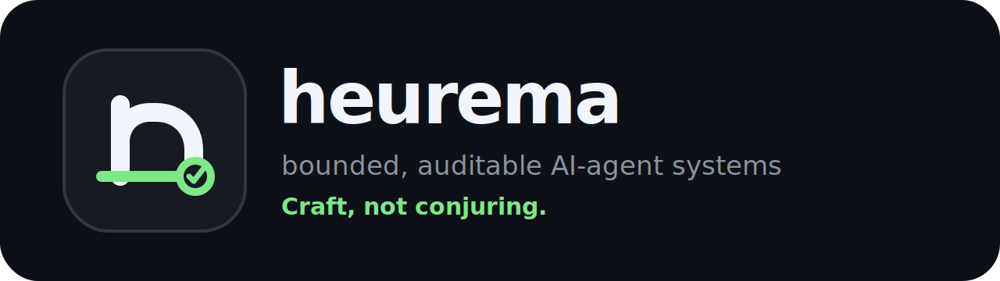

  

  <strong>Bounded, auditable AI-agent systems for software delivery.</strong> 
  <em>Craft, not conjuring.</em>

---

AI agents can move faster than teams can govern them. **heurema** builds open-source tools and operating patterns that make agentic software work bounded, reviewable, secure, and vendor-neutral.

We care less about magical demos and more about one repeatable outcome:

> **from business intent to verified code change.**

## What we build

| Surface | Purpose |
|---|---|
| **Goalrail** | Contract-first operating layer for AI-assisted delivery: intent -> contract -> work item -> evidence. |
| **Signum** | Risk-adaptive development pipeline for bounded AI-assisted changes and adversarial review. |
| **Proofpack** | Proof-carrying CI gate for agent-generated or agent-assisted code changes. |
| **Arbiter** | Multi-model review and orchestration layer for asking, implementing, reviewing, and comparing agent output. |
| **Nex / Emporium** | Local-first plugin distribution for AI-agent tools across developer runtimes. |
| **Field guides** | Practical playbooks for teams adopting AI agents without losing accountability. |

## Our thesis

AI delivery fails when teams automate execution before they define:

- the intent;
- the boundary of the work;
- the context an agent is allowed to use;
- the checks that prove the change is safe;
- the human who owns the outcome;
- the audit trail that explains what happened.

So we design systems around **contracts, gates, receipts, tests, reviews, and rollback paths**.

## Principles

1. **Discovery before automation.** Find the right work, not just faster work.
2. **Accountability is not delegatable.** Agents execute; humans own outcomes.
3. **Context is a product.** Bad context produces confident wrong output.
4. **Boundaries beat prompts.** A good agent workflow limits scope before it asks for output.
5. **Tests are contracts.** If a machine cannot check it, it is only a suggestion.
6. **Silent autonomy is a defect.** No audit trail means no trustworthy work.
7. **Security gates before scale.** Faster unsafe delivery is not progress.
8. **Vendor-neutral by design.** Models, tools, prompts, evals, and workflows must remain portable.
9. **Local-first when possible.** Sensitive code and context should not leave the boundary without a reason.
10. **No magic claims.** We measure proof, rework, defects, cost, and delivery impact.

## For software teams

If your team already uses AI coding tools but delivery still feels chaotic, the missing layer is usually not another model. It is a delivery system:

- clear intake;
- bounded delivery contracts;
- agent-ready context packages;
- human approval gates;
- security and dependency checks;
- test evidence;
- review evidence;
- rollback and learning loops.

The first implementation should be narrow: an agent may draft a plan, prepare a PR, generate tests, or review a change, but it should not silently merge, deploy, or touch production secrets.

## For builders and contributors

We welcome practical contributions that make AI-agent workflows more:

- auditable;
- local-first;
- secure by default;
- portable across models and tools;
- measurable;
- boring enough to run in real teams.

Start with a small issue, a reproducible example, or a concrete workflow improvement. Avoid broad rewrites without a proposal.

## Commercial use

heurema is open-source-first, but the methodology is designed for real delivery teams. Commercial work should be scoped as:

1. **AI Delivery & Security Audit** — map the current SDLC, risks, bottlenecks, and first safe agent workflows.
2. **Goalrail Pilot** — implement one bounded workflow from business intent to verified code change.
3. **AI Delivery Lead Retainer** — improve workflows, evals, governance, and ROI tracking over time.

No vendor lock-in. No fake ROI promises. No autonomous production changes without explicit gates.

---

**The measure of a heurema tool:** when something goes wrong, you know where it happened, why it happened, what evidence exists, and who owns the next decision.
